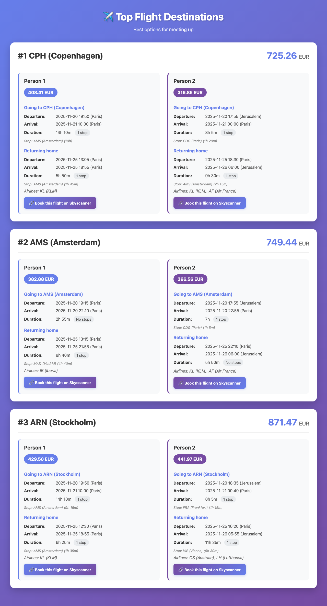

# ✈️ Fladar - Flight Meeting Destination Finder

**Find the perfect meeting destination for two people by automatically searching flights with matching arrival times.**

A powerful Python application that helps two people find where to meet by searching flights from their respective cities. Uses Amadeus Flight API to discover destinations, search for flights, match arrivals within a time window, and filter by price, stops, and departure times. Perfect for planning trips, finding meeting points, or discovering travel destinations.

## 📸 Output Preview

The application generates a comprehensive HTML report displaying the top meeting destinations (configurable, default: 3) with detailed flight information for both travelers.



**Output Features:**
- **Visual Design**: Modern gradient interface with responsive layout
- **Flight Details**: Complete itinerary information for both persons including departure and arrival times in local timezones
- **Stop Information**: Connection details with airport codes and layover durations
- **Booking Integration**: Direct links to Skyscanner for each flight option
- **Pricing**: Individual and total costs with currency information
- **Airlines**: Full airline names and codes for all flight segments

**Keywords:** flight search, find flights, flight API, Amadeus API, meeting destination, flight finder, travel planner, flight matching, Python flight search, easy flight search, automatic flight search, flight discovery

> 💡 **Tip:** Add GitHub Topics to your repository for better discoverability! See [.github/QUICK_SETUP.md](.github/QUICK_SETUP.md) for instructions.

## 🎯 What It Does

The application helps two people find a meeting destination by:
1. **Discovering destinations** dynamically using Amadeus API or a predefined list
2. **Searching flights** from both origins to each destination (round-trip, one-way outbound, or one-way return)
3. **Matching flights** where arrivals/departures are within a configurable tolerance window
4. **Filtering results** by price, stops, duration, and departure times
5. **Outputting results** in console, CSV, and HTML formats with all flight details

## ✨ Key Features

- 🔍 **Dynamic Destination Discovery**: Automatically finds destinations using Amadeus Flight Inspiration Search API
- 🎯 **Smart Matching**: Matches flights where both people arrive/depart within ±3-6 hours (configurable)
- ✈️ **Flight Types**: Supports round-trip ("both"), one-way outbound ("outbound"), or one-way return ("return") flights
- 💰 **Price Filtering**: Filters by maximum price per person (round-trip or one-way based on flight type)
- ⏱️ **Time Constraints**: Separate minimum departure times for outbound and return flights
- 🚫 **Stops Control**: Configurable maximum stops per person (default: direct flights only)
- ⏰ **Duration Filtering**: Optional maximum flight duration limit per person
- 🗺️ **Nearby Airports**: Search from nearby airports within a configurable radius
- 🔄 **Return Airport Flexibility**: Return flights can depart from nearby airports of destination
- 💾 **Caching**: Caches destination and flight data to reduce API calls
- ⚡ **API Optimization**: Pre-validates routes and early-exit optimizations to save API calls
- 📊 **Rich Output**: Console, CSV, and HTML with local times, airline names, human-readable descriptions
- 🌍 **Auto Timezones**: Automatic timezone detection for all airports
- 🔗 **Booking Links**: Direct links to Google Flights or Skyscanner for each flight option

## 🚀 Quick Start

> **⚠️ Security First:** Before you start, please read the **[Security Checklist](docs/SECURITY_CHECKLIST.md)** to understand how to protect your API credentials and avoid committing sensitive information to the repository.

> **📋 Upgrading from v1.0.0?** If you're upgrading from version 1.0.0, please see the **[Migration Guide](docs/MIGRATION_GUIDE.md)** for important configuration changes.

### 1. Prerequisites

- Python 3.11+
- Poetry (for dependency management)

### 2. Install Poetry (if not already installed)

**macOS/Linux:**
```bash
curl -sSL https://install.python-poetry.org | python3 -
```

**macOS with Homebrew:**
```bash
brew install poetry
```

**Windows:**
```powershell
(Invoke-WebRequest -Uri https://install.python-poetry.org -UseBasicParsing).Content | python -
```

### 3. Clone and Setup

```bash
# Clone the repository
git clone https://github.com/igor-olikh/fladar.git
cd fladar

# Install dependencies (creates virtual environment automatically)
poetry install

# Verify setup
poetry env info
```

### 4. Get Amadeus API Credentials

1. Go to [Amadeus for Developers](https://developers.amadeus.com/)
2. Sign up for a free account
3. Create a new app to get your **API Key** and **API Secret**
4. Free tier includes 2,000 API calls per month

### 5. Configure the Application

> **🔒 Important:** Make sure you've read the [Security Checklist](docs/SECURITY_CHECKLIST.md) before adding your API credentials!

Copy the example config file and edit it:

```bash
cp config.yaml.example config.yaml
```

Edit `config.yaml` and add your API credentials:

```yaml
api:
  amadeus_api_key: "YOUR_API_KEY_HERE"
  amadeus_api_secret: "YOUR_API_SECRET_HERE"
  environment: "test"  # or "production" for live data
```

### 6. Run the Application

**With Poetry (recommended):**
```bash
poetry run python main.py
```

**Or activate the virtual environment first:**
```bash
# Activate virtual environment
source .venv/bin/activate  # macOS/Linux
# or
.venv\Scripts\activate  # Windows

# Run the application
python main.py
```

## 📋 Configuration Guide

### Basic Configuration

```yaml
# Origin cities (IATA codes)
origins:
  person1: "TLV"  # Tel Aviv
  person2: "ALC"  # Alicante

# Search parameters
search:
  outbound_date: "2025-11-20"      # Departure date (YYYY-MM-DD)
  return_date: "2025-11-25"        # Return date (YYYY-MM-DD)
  max_price: 600                   # Maximum price per person (EUR)
  max_stops_person1: 0             # Maximum stops for Person 1 (0 = direct only)
  max_stops_person2: 0             # Maximum stops for Person 2 (0 = direct only)
  arrival_tolerance_hours: 6       # ±6 hours for arrival matching
```

### Advanced Configuration

```yaml
search:
  # Flight type: "both" (round trip), "outbound" (one-way to destination), or "return" (one-way from destination)
  flight_type: "both"  # Options: "both", "outbound", "return"
  
  # Nearby airports search (useful for major cities)
  nearby_airports_radius_km: 200   # Search within 200km radius
  
  # Return flight airport radius (km) - return flights can depart from nearby airports of destination
  return_airport_radius_km: 0      # 0 = same airport, or set to e.g., 100 for 100 km radius
  
  # Flight duration limit (per person)
  max_flight_duration_hours_person1: 0  # 0 = no limit, or set to e.g., 6 for 6-hour max
  max_flight_duration_hours_person2: 0  # 0 = no limit, or set to e.g., 6 for 6-hour max
  
  # Destination discovery
  use_dynamic_destinations: true   # Use API to discover destinations
  max_destinations_to_check: 50    # Limit number of destinations to search
  destinations_to_check: []        # Optional: specific destinations to check (skips discovery if provided)
  
  # API optimization
  pre_validate_routes: true        # Pre-validate routes using cheaper APIs (saves 50-80% of calls)
  max_flight_results: 20           # Maximum results to request from API (default: 20)
  early_exit_on_no_flights: true   # Skip Person 2 search if Person 1 has no flights (saves 50% of calls)
  
  # Caching
  destination_cache_expiration_days: 30  # Cache destinations for 30 days
  use_flight_cache: true           # Cache flight results for same day
  
  # Time constraints
  min_departure_time_outbound: "14:00"   # Don't depart earlier than 14:00
  min_departure_time_return: "14:00"     # Don't leave destination earlier than 14:00

# API environment
api:
  environment: "test"  # "test" or "production"/"live"

# Output settings
output:
  format: "console,csv"            # Output formats: "console", "csv", or "console,csv"
  csv_file: "flight_results.csv"   # CSV output file path
  html_file: "flight_results.html" # HTML output file path
  html_top_destinations: 3         # Number of top destinations to display in HTML
  booking_link_provider: "google_flights"  # Options: "google_flights" or "skyscanner"
```

### Configuration Parameters Explained

| Parameter | Description | Default |
|-----------|-------------|---------|
| `outbound_date` | Departure date (YYYY-MM-DD) | Required |
| `return_date` | Return date (YYYY-MM-DD) | Required for "both" or "return", ignored for "outbound" |
| `flight_type` | Flight type: "both" (round trip), "outbound" (one-way to destination), or "return" (one-way from destination) | "both" |
| `max_price` | Maximum price per person (EUR). For "both": round-trip price. For "outbound"/"return": one-way price | Required |
| `max_stops_person1` | Maximum number of stops for Person 1 (0 = direct only) | 0 |
| `max_stops_person2` | Maximum number of stops for Person 2 (0 = direct only) | 0 |
| `arrival_tolerance_hours` | Hours tolerance for arrival matching | 3 |
| `nearby_airports_radius_km` | Search radius for nearby airports (0 = disabled) | 0 |
| `return_airport_radius_km` | Return flight airport radius (km) - return flights can depart from nearby airports of destination | 0 |
| `max_flight_duration_hours_person1` | Maximum flight duration for Person 1 in hours (0 = no limit) | 0 |
| `max_flight_duration_hours_person2` | Maximum flight duration for Person 2 in hours (0 = no limit) | 0 |
| `use_dynamic_destinations` | Use API to discover destinations | true |
| `max_destinations_to_check` | Limit destinations to search (0 = all) | 50 |
| `destinations_to_check` | Optional list of specific destinations to check (skips discovery if provided) | [] |
| `pre_validate_routes` | Pre-validate routes using cheaper APIs before Flight Offers Search | true |
| `max_flight_results` | Maximum results to request from Flight Offers Search API | 20 |
| `early_exit_on_no_flights` | Skip Person 2 search if Person 1 has no flights | true |
| `destination_cache_expiration_days` | Cache expiration for destinations | 30 |
| `use_flight_cache` | Cache flight results for same day | true |
| `min_departure_time_outbound` | Minimum departure time from origin (HH:MM) | None |
| `min_departure_time_return` | Minimum departure time from destination (HH:MM) | None |
| `environment` | API environment: "test" or "production"/"live" | "test" |
| `html_top_destinations` | Number of top destinations to display in HTML output | 3 |
| `booking_link_provider` | Booking link provider: "google_flights" or "skyscanner" | "google_flights" |

## 📊 Output Format

### Console Output

The application displays:
- Search parameters
- Progress for each destination
- Matching flight pairs with:
  - Destination city
  - Total price and individual prices
  - Outbound and return flight details
  - Flight durations (human-readable: "5h 30m")
  - Number of stops ("No stops", "1 stop", "2 stops")
  - Airlines with full names
  - Departure and arrival times

### CSV Output

The CSV file (`flight_results.csv` by default) includes:

**Main Columns:**
- `route`: Combined route (e.g., "TLV & ALC → AMS")
- `description`: Human-readable description of the flight option
- `destination`: Destination airport code
- `total_price_eur`: Total price for both people
- `price_person1_eur`, `price_person2_eur`: Individual prices

**Person 1 & Person 2 Details:**
- Route information
- Outbound departure/arrival (UTC and local times)
- Return departure/arrival (UTC and local times)
- Flight durations (human-readable)
- Number of stops (human-readable)
- Airlines (with full names)

**Time Information:**
- All times are shown in both UTC and local time
- Local times are automatically detected for each airport
- Departure times show local time at departure airport
- Arrival times show local time at arrival airport

### HTML Output

The HTML file (`flight_results.html` by default) provides a visually appealing report with:
- **Top destinations**: Displays the top N destinations (configurable via `html_top_destinations`, default: 3)
- **Best flight per destination**: Shows the cheapest flight option for each destination
- **Complete flight details**: Departure/arrival times, durations, stops, and airlines
- **Stop information**: Airport codes and layover durations for connections
- **Booking links**: Direct links to Skyscanner for each flight
- **Responsive design**: Works on desktop and mobile devices

The number of destinations shown can be configured in `config.yaml` using the `html_top_destinations` parameter.

## 🔧 How It Works

### 1. Destination Discovery

The application can discover destinations in two ways:

**Dynamic Discovery (default):**
- Uses Amadeus Flight Inspiration Search API
- Finds destinations from both origins
- Intersects results to find common destinations
- Falls back to predefined list if API fails

**Predefined List:**
- Uses a curated list of 32 popular European destinations
- More reliable in test environment
- Faster (no API calls needed)

### 2. Flight Search

For each destination:
- Searches flights from both origins (round-trip, one-way outbound, or one-way return based on `flight_type`)
- Optionally searches from nearby airports (if `nearby_airports_radius_km` is set)
- For round-trip flights, optionally allows return flights from nearby airports of destination (if `return_airport_radius_km` is set)
- Pre-validates routes using cheaper APIs if `pre_validate_routes` is enabled (saves API calls)
- Filters by stops, duration, and departure times
- Caches results to avoid redundant API calls

### 3. Matching Logic

Flights are matched if:
- Both people have flights to/from the same destination (based on flight type)
- For round-trip ("both"): Arrival times are within the tolerance window (±3-6 hours)
- For one-way return ("return"): Departure times are within the tolerance window (±3-6 hours)
- Prices are within the maximum limit
- All other filters pass (stops, duration, times)

**Flight Types:**
- **"both"** (round-trip): Searches for outbound and return flights, matches by arrival times
- **"outbound"** (one-way to destination): Searches only flights going to destination, matches by arrival times
- **"return"** (one-way from destination): Searches only flights leaving from destination, matches by departure times

### 4. Result Processing

- Deduplicates identical flight pairs
- Sorts by total price (cheapest first)
- Formats output with human-readable information
- Converts times to local timezones automatically

## 🧪 Testing

Run all tests:

```bash
poetry run python run_tests.py
```

Run specific test files:

```bash
poetry run python -m unittest test_flight_search test_integration -v
```

Test API connection:

```bash
poetry run python tests/test_real_api.py
```

## 📁 Project Structure

```
fladar/
├── main.py                 # Main entry point
├── flight_search.py        # Amadeus API integration
├── destination_finder.py   # Destination discovery logic
├── output_formatter.py     # CSV and console output
├── run_tests.py            # Test runner script
├── config.yaml             # Your configuration (create from example)
├── config.yaml.example     # Configuration template
├── tests/                  # Test files
│   ├── __init__.py
│   ├── test_flight_search.py
│   ├── test_integration.py
│   ├── test_api_connection.py
│   └── test_real_api.py
├── data/
│   ├── airport_names.json  # Airport code to city name mapping
│   ├── airline_names.json  # Airline code to name mapping
│   ├── destinations_cache/ # Cached destination data
│   └── flights_cache/      # Cached flight search results
├── docs/                   # Detailed documentation
│   ├── api_usage_explanation.md
│   ├── amadeus_test_vs_production.md
│   └── ...
├── .github/                # GitHub configuration
│   ├── QUICK_SETUP.md
│   ├── REPOSITORY_DESCRIPTION.md
│   └── TOPICS.md
└── debug_logs/            # Debug log files
```

## 📚 Documentation

- **[docs/PROJECT_EXPLANATION.md](docs/PROJECT_EXPLANATION.md)**: Comprehensive project overview
- **[docs/FLIGHT_RESULTS_EXPLANATION.md](docs/FLIGHT_RESULTS_EXPLANATION.md)**: How to read the output
- **[docs/api_usage_explanation.md](docs/api_usage_explanation.md)**: Amadeus API details
- **[docs/amadeus_test_vs_production.md](docs/amadeus_test_vs_production.md)**: Test vs Production differences
- **[docs/SECURITY_CHECKLIST.md](docs/SECURITY_CHECKLIST.md)**: Security checklist for pre-commit review

## ⚠️ Troubleshooting

### "Amadeus API credentials not set"
- Make sure you've added your API key and secret to `config.yaml`
- Check that the file is named `config.yaml` (not `config.yaml.example`)

### "No matching flights found"
- Try increasing `max_price`
- Try increasing `arrival_tolerance_hours`
- Try allowing stops by setting `max_stops_person1` and/or `max_stops_person2` to 1 or 2
- Check that your dates are valid and in the future
- Try using `use_dynamic_destinations: false` to use predefined list

### "404 error: No data available for origin"
- This is normal in test environment for some origins (e.g., TLV)
- The application will automatically fall back to predefined destinations
- For better results, switch to `environment: "production"` with production credentials

### API Rate Limit Errors
- Free tier has 2,000 calls per month
- Each destination search uses multiple API calls
- Reduce `max_destinations_to_check` to limit API usage
- Enable caching (`use_flight_cache: true`) to reuse results

### Test vs Production Environment

**Test Environment:**
- Limited cached data
- Some origins may not have data (e.g., TLV)
- Good for testing and development
- Free, no billing

**Production Environment:**
- Live, real-time data
- Complete coverage for all origins
- Free quota per month, then billed
- Requires production API credentials

See [docs/amadeus_test_vs_production.md](docs/amadeus_test_vs_production.md) for details.

## 🎓 Tips for Best Results

1. **Start with test environment** to verify setup
2. **Use production environment** for real searches
3. **Enable caching** to save API calls during development
4. **Limit destinations** (`max_destinations_to_check: 20-50`) for faster results
5. **Use nearby airports** for major cities (e.g., 200km radius for Tel Aviv)
6. **Check CSV output** for detailed flight information
7. **Review debug logs** in `debug_logs/` for troubleshooting

## 📝 Notes

- IATA airport codes are used (e.g., TLV for Tel Aviv, ALC for Alicante)
- Prices are in EUR (as returned by Amadeus API)
- Flight prices and availability are subject to change
- The application uses Amadeus API for flight data
- Timezones are automatically detected using airport coordinates
- Non-airport codes (like railway stations) are automatically resolved to nearest airports

## 🤝 Contributing

Contributions are welcome! If you improve this project, please consider submitting a pull request. See the [License](#-license) section for details.

### Branching Strategy

- **`main`**: Stable, production-ready code. Only merged from `dev` after testing.
- **`dev`**: Development branch for ongoing work. All new features and fixes go here first.

### How to Contribute

1. **Fork the repository**
2. **Clone your fork**:
   ```bash
   git clone https://github.com/YOUR_USERNAME/fladar.git
   cd fladar
   ```
3. **Set up development branch**:
   ```bash
   git checkout dev
   git pull origin dev
   ```
4. **Create a feature branch**:
   ```bash
   git checkout -b feature/your-feature-name
   ```
5. **Make your changes** and test them
6. **Commit your changes**:
   ```bash
   git add .
   git commit -m 'Add your feature description'
   ```
7. **Push to your fork**:
   ```bash
   git push origin feature/your-feature-name
   ```
8. **Open a Pull Request** to the `dev` branch (not `main`)

### Development Workflow

- All new features and bug fixes should target the `dev` branch
- Pull requests should be made to `dev`, not `main`
- After testing and review, changes are merged from `dev` to `main` for releases

## 🌟 Features in Detail

- **Easy Flight Search**: Simple configuration, powerful results
- **Automatic Destination Discovery**: No need to manually list destinations
- **Smart Matching**: Finds flights where both people arrive at similar times
- **Flexible Filtering**: Price, stops, duration, departure times
- **Rich Output**: CSV with local times, airline names, human-readable descriptions
- **API Integration**: Uses Amadeus Flight API for real-time flight data
- **Caching**: Reduces API calls with intelligent caching
- **Timezone Support**: Automatic timezone detection for all airports

## 📄 License

This project is licensed under the **GNU General Public License v3.0 (GPL-3.0)**.

### What this means:

- ✅ **You can use** this software for any purpose
- ✅ **You can modify** the code
- ✅ **You can distribute** the software
- ⚠️ **You must** release any modifications under the same GPL-3.0 license
- ⚠️ **You must** include the original license and copyright notice

### Contributing Back

If you improve or modify this software, you are **encouraged** to contribute your improvements back to the original repository by submitting a pull request. This helps everyone benefit from improvements!

See the full license text in [LICENSE](LICENSE) file.

**Note:** GPL-3.0 is a "copyleft" license, which means derivative works must also be open source and use the same license. This ensures improvements remain available to everyone.
